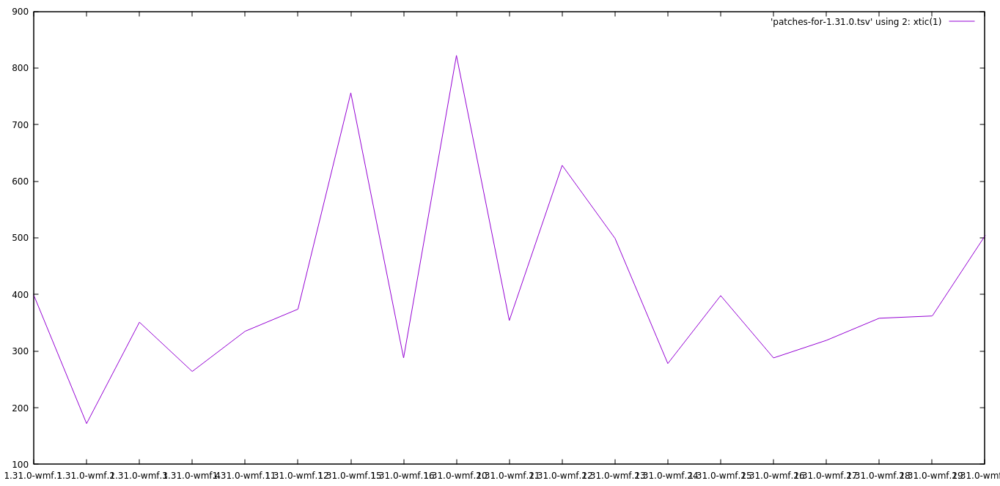
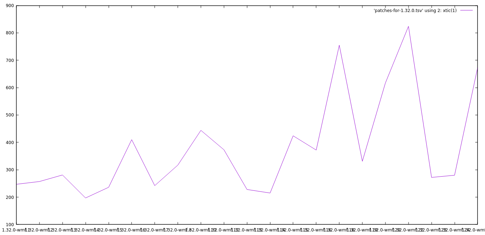
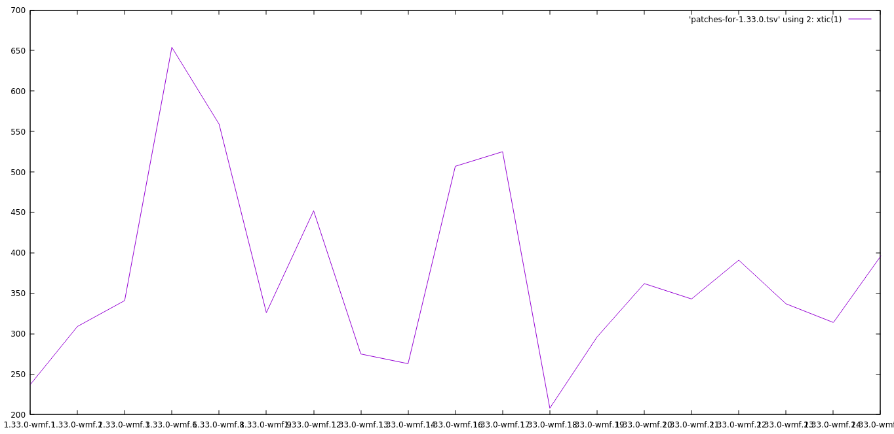
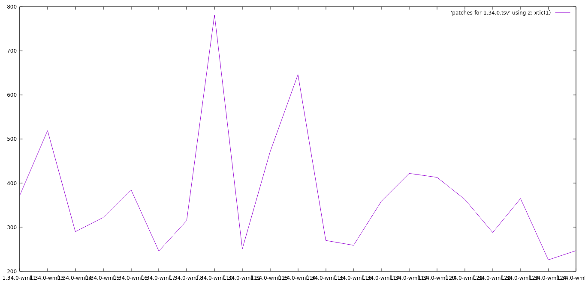
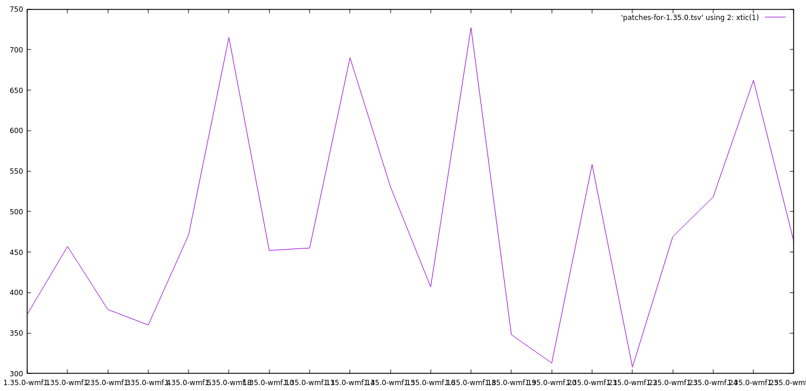
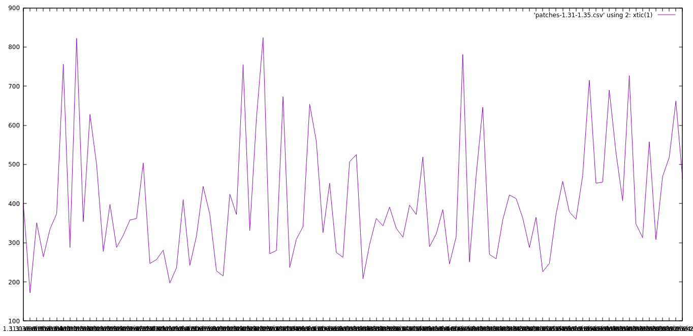

# Patches Per Deployment

How many patches make up a WMF deployment?

```
for i in {1..25}; do
    python3 deploy-stats-historic.py -w "1.3x.0-wmf.${i}" | tee patches-for-1.3x.tsv
done
```

Then I plotted using gnuplot:

```
set boxwidth 0.5
set style fill solid
plot 'patches-for-1.3x.tsv' using 2: xtic(1) with lines
```

# The graphs

## 1.31



## 1.32



## 1.33



## 1.34



## 1.35



## 1.31 -- 1.35



# Patches per series

## Total

```
$ for i in patches-for-*.tsv; do printf "$i\t"; cat "$i" | awk '{sum += $2}END{print sum}'; done
patches-for-1.31.0.tsv	7749
patches-for-1.32.0.tsv	7995
patches-for-1.33.0.tsv	7095
patches-for-1.34.0.tsv	7810
patches-for-1.35.0.tsv	9656
```
## Average
```
$ for i in patches-for-*.tsv; do printf "$i\t"; cat "$i" | awk '{sum += $2}END{print sum/NR}'; done
patches-for-1.31.0.tsv	407.842
patches-for-1.32.0.tsv	380.714
patches-for-1.33.0.tsv	373.421
patches-for-1.34.0.tsv	371.905
patches-for-1.35.0.tsv	482.8
```

## Max

```
$ for i in patches-for-*.tsv; do printf "$i\t"; cat "$i" | awk 'BEGIN{max=0}{if ($2 > max) {max = $2}}END{print max}'; done
patches-for-1.31.0.tsv	822
patches-for-1.32.0.tsv	824
patches-for-1.33.0.tsv	654
patches-for-1.34.0.tsv	781
patches-for-1.35.0.tsv	727
```

## Min

```
$ for i in patches-for-*.tsv; do printf "$i\t"; cat "$i" | awk 'BEGIN{min=10000}{if ($2 < min) {min = $2}}END{print min}'; done
patches-for-1.31.0.tsv	172
patches-for-1.32.0.tsv	197
patches-for-1.33.0.tsv	208
patches-for-1.34.0.tsv	226
patches-for-1.35.0.tsv	308
```
