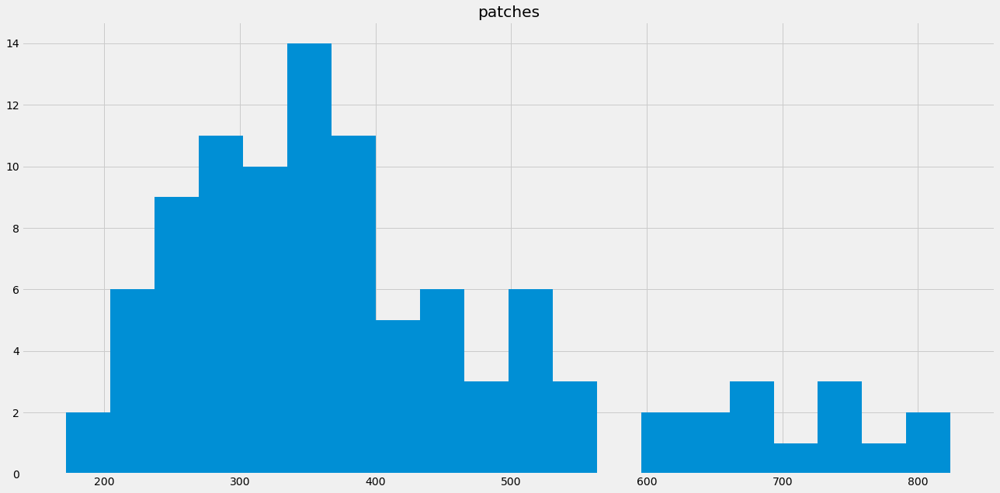
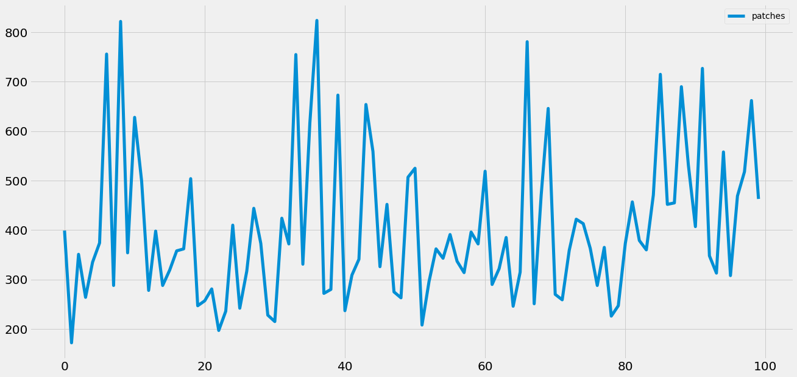
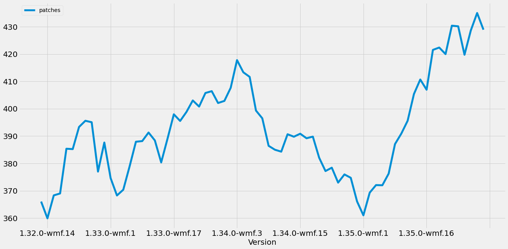
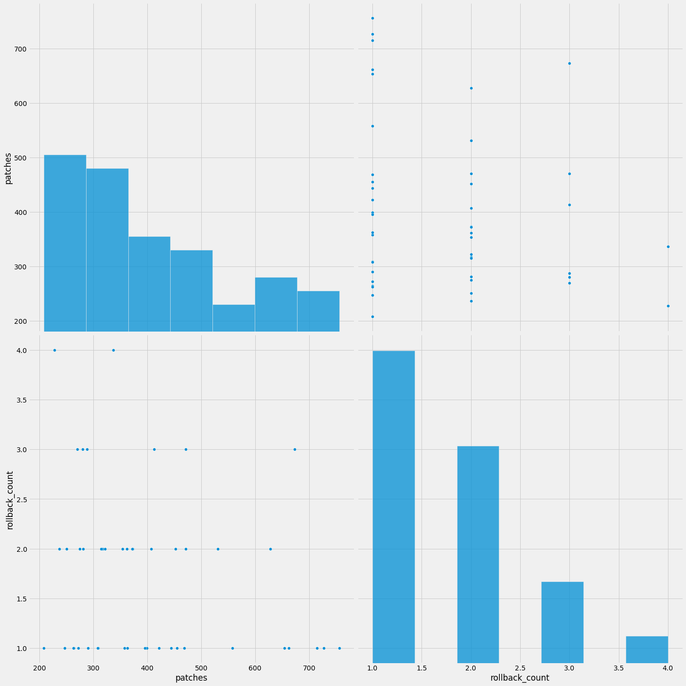

Train stats
===========

Every week we batch up all the change on the mainline branch and deploy
that delta to production. We collect the number of patches for each
train.

The data associates each train version with a number of patches. Here's
a preview of what the data looks like:

.. parsed-literal::

             version  patches
    0   1.31.0-wmf.1      399
    1   1.31.0-wmf.2      172
    2   1.31.0-wmf.3      351
    3   1.31.0-wmf.4      264
    4  1.31.0-wmf.11      335
              patches
    count  100.000000
    mean   403.050000
    std    153.116604
    min    172.000000
    25%    288.000000
    50%    362.500000
    75%    469.500000
    max    824.000000

Trends in train size
--------------------

Looking at the rolling average train size, it's on the uptick in terms
of number of patches per train for the last 30 trains.

Rollbacks
=========

.. raw:: html

    

    
    <table border="1" class="dataframe">
      <thead>
        <tr style="text-align: right;">
          <th></th>
          <th>version</th>
          <th>rollback_count</th>
        </tr>
      </thead>
      <tbody>
        <tr>
          <th>0</th>
          <td>1.36.0-wmf.36</td>
          <td>3</td>
        </tr>
        <tr>
          <th>1</th>
          <td>1.36.0-wmf.35</td>
          <td>3</td>
        </tr>
        <tr>
          <th>2</th>
          <td>1.36.0-wmf.34</td>
          <td>1</td>
        </tr>
        <tr>
          <th>3</th>
          <td>1.36.0-wmf.33</td>
          <td>1</td>
        </tr>
        <tr>
          <th>4</th>
          <td>1.36.0-wmf.30</td>
          <td>1</td>
        </tr>
      </tbody>
    </table>
    

.. raw:: html

    

    
    <table border="1" class="dataframe">
      <thead>
        <tr style="text-align: right;">
          <th></th>
          <th>patches</th>
          <th>rollback_count</th>
        </tr>
        <tr>
          <th>version</th>
          <th></th>
          <th></th>
        </tr>
      </thead>
      <tbody>
        <tr>
          <th>1.31.0-wmf.1</th>
          <td>399</td>
          <td>1</td>
        </tr>
        <tr>
          <th>1.31.0-wmf.4</th>
          <td>264</td>
          <td>1</td>
        </tr>
        <tr>
          <th>1.31.0-wmf.15</th>
          <td>756</td>
          <td>1</td>
        </tr>
        <tr>
          <th>1.31.0-wmf.21</th>
          <td>354</td>
          <td>2</td>
        </tr>
        <tr>
          <th>1.31.0-wmf.22</th>
          <td>628</td>
          <td>2</td>
        </tr>
      </tbody>
    </table>
    

.. parsed-literal::

    <seaborn.axisgrid.PairGrid at 0x7fb06cfbd820>

